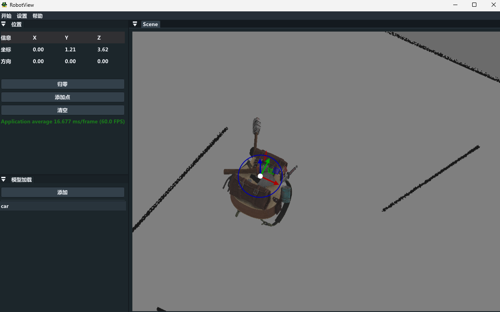

# Object View

- Simple 3D object view for windows
- You can add more features. refer to [learnopengl](https://learnopengl.com/)
- support load pgm map, you can  make a simple ros application using ros-serial. refer to [RosView](https://github.com/icetd/RosView.git)

## build

```
cd ObjectView
mkdir build && cd build
cmake ..

then open the ObjectView.sln
```

## demo


